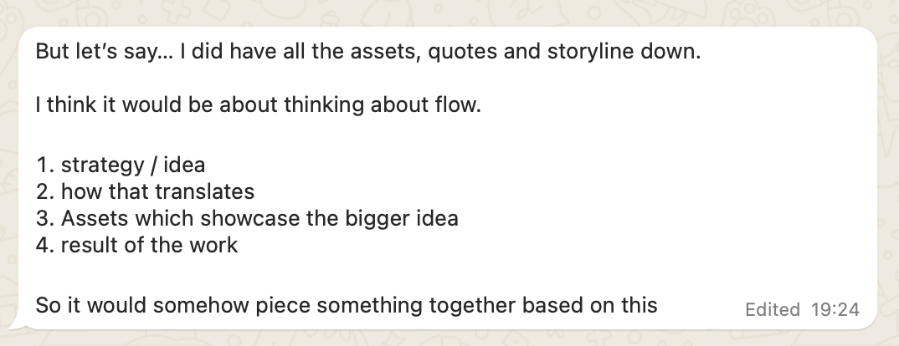

## Research

Conducted a little bit of light touch user research to get the ball rolling and spark some ideas for how people currently curate their portfolios for use cases and clients.

### Participants

5 participants across the design industry. Primarily consultants/agencies and a freelancer.

- Communication Design Lead @ Tier 1 Design Consultancy
- Business Development Director @ Tier 1 Design Consultancy
- Freelance Staff level Graphic / Brand Designer
- Digital Design & Prototyping Partner @ Web3 Design Studio
- Founder & Partner @ Boutique Design + Brand Agency

### The Questions

- What kinds of things do you think about when you’re creating a case study deck / mini portfolio thing to showcase to potential clients to win the work?
- What would you want an ai tool to consider when selecting and showing your work… and effectively curating it for an audience.
- What are some of the biggest pain points when creating a case study deck / mini portfolio thing to showcase to potential clients to win the work?

### Key Insights

A set of some early insights, themes and needs that emerged from the light touch research.

#### 1. Tailor Content to Audience Needs

Different audiences require tailored content, whether for designers, technical teams, or clients. Customization is essential for relevancy and impact.

> "Make this portfolio for a designer audience... this one for a technical audience."

#### 2. Provide Varied Output Formats

Flexibility in output formats (e.g., blog post, collage, animation) enables users to present their work in diverse, engaging ways, suited to different presentation contexts.

> "Make it a blog post, make it a collage, make it animation... almost drop all files here and get a stack of different options."

#### 3. Highlight Process and Roles Involved

Clients value seeing the process, not just the final result. Showcasing methodology and collaboration adds depth and credibility to the work.

> "A bit about method – but visual... And roles. Different designers + client. Who did you work with to get this done?"

#### 4. Categorize by Client Type and Purpose

Structuring case studies by client needs (e.g., startups vs. consulting firms) can streamline the selection and presentation process.

> "Maybe divide client types between early startups and consulting firms so there’s an auto selection of most valuable work."

#### 5. Offer Modular Curation Options

Users want control over how much detail to share. The tool should allow toggling content length and style for versatility.

> "Maybe toggles or drag and drop options for style, length... short, medium, long version of case studies."

### Some Screenshots

